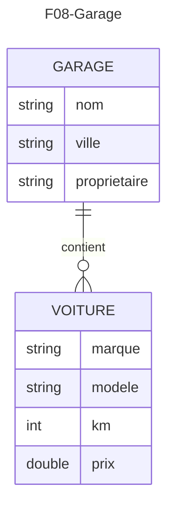
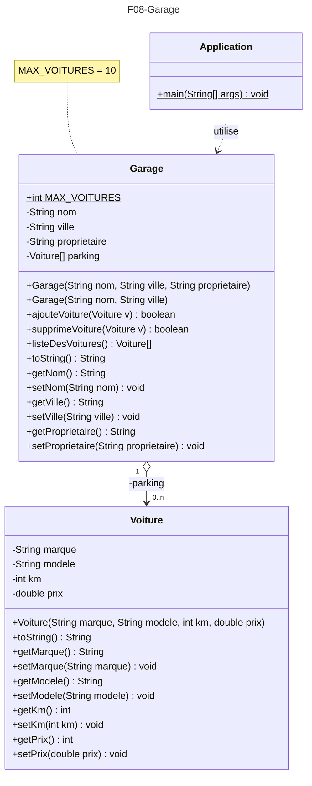

# Diagramme ER - Notation "patte d'oie" :

# Diagramme UML - Séquence du main() de l'application :
```mermaid
---
title: F08-Garage
---
sequenceDiagram
    main()->>Garage monGarage : <<creation>>
    main()->>Voiture v1 : <<creation>>
    main()->>Voiture v2 : <<creation>>
    main()->>Voiture v3 : <<creation>>
    main()->>+Garage monGarage : ajouteVoiture(v1)
    Garage monGarage-->>-main(): ajoutOK
    alt ajoutOK == true
        main()->>System.out : println("Ajout de v1 a réussi !")
        main()->>+Garage monGarage : ajouteVoiture(v2)
        Garage monGarage-->>-main(): ajoutOK
        alt ajoutOK == true
            main()->>System.out : println("Ajout de v2 a réussi !")
            main()->>+Garage monGarage : ajouteVoiture(v3)
            Garage monGarage-->>-main(): ajoutOK
            alt ajoutOK == true
                main()->>System.out : println("Ajout de v3 a réussi !")

                main()->>+Garage monGarage : toString()
                Garage monGarage-->>-main(): txtGarage

                main()->>System.out : println("Voici le contenu du Garage : " + txtGarage)

                main()->>+Garage monGarage : listeDesVoitures()
                Garage monGarage-->>-main(): voitures

                loop FOR EVERY voiture IN voitures NOT NULL
                    main()->>System.out : println(voiture)
                end

            else
                main()->>System.err : println("La voiture v3 n'a pas été ajoutée car le parking est plein !")
            end
        else
            main()->>System.err : println("La voiture v2 n'a pas été ajoutée car le parking est plein !")
        end
    else
        main()->>System.err : println("La voiture v1 n'a pas été ajoutée car le parking est plein !")
    end
```

# Diagramme UML - Classes de l'application :

