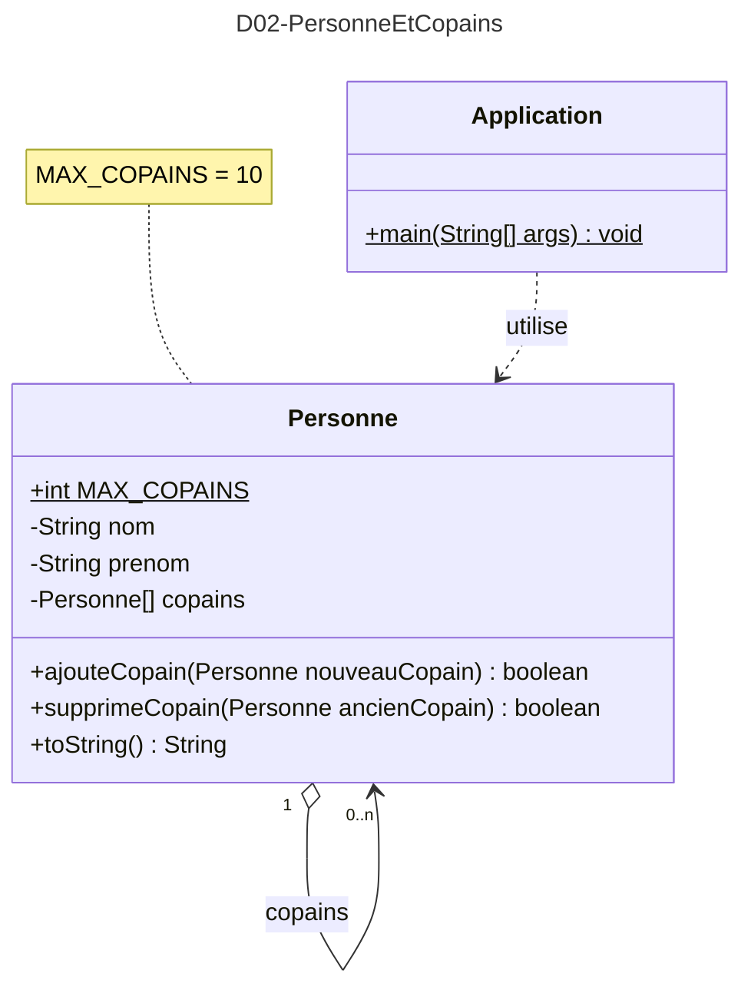

# UML :
Ci-dessous le diagramme de classes UML pour l'ensemble de ce programme  :

```mermaid
---
title: D02-PersonneEtCopains
---
classDiagram
class Application {
    +main(String[] args)$ void
}
class Personne {
    +int MAX_COPAINS$
    -String nom
    -String prenom
    -Personne[] copains
    +ajouteCopain(Personne nouveauCopain) boolean
    +supprimeCopain(Personne ancienCopain) boolean
    +toString() String
}
note for Personne "MAX_COPAINS = 10"
Personne "1" o--> "0..n" Personne : copains
Application ..> Personne : utilise
```
